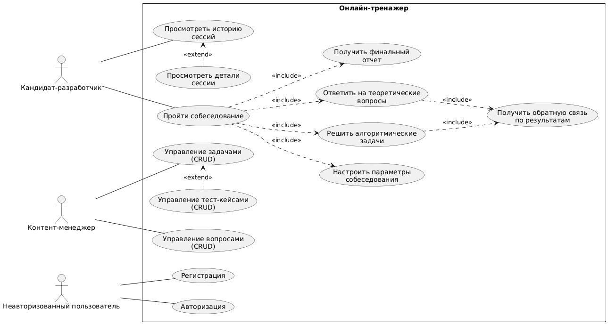

# Лабораторная работа №1

**Тема:** Формулирование требований к программной системе

**Цель работы:** Научиться анализировать поставленную задачу, формулировать функциональные и нефункциональные требования к проектируемой системе

## Перечень заинтересованных лиц

1. Кандидаты-разработчики: основные пользователи системы. Используют систему для тренировки навыков, решения задач и оценки своей готовности

2. Разработчики платформы и команда сопровождения: создают и поддерживают платформу, отвечают за новую функциональность, исправление ошибок

3. Контент-менеджеры: специалисты, наполняющие и поддерживающие актуальность базы вопросов и задач. На начальной стадии — сами разработчики

4. Владелец продукта: определяет цели, приоритеты и развитие системы

## Перечень функциональных требований

### 1. Управление пользователями

- Регистрация пользователя через email и пароль
- Авторизация в системе
- Просмотр истории сессий и результатов

### 2. Настройка параметров собеседования

- Выбор уровня сложности/грейда (Junior/Middle/Senior)
- Выбор языка программирования
- Выбор специализации (Backend/Frontend/Fullstack и др.)

### 3. Проведение сессии собеседования

- Отображение количества заданий и лимита по времени
- Предоставление теоретических вопросов с открытым текстовым ответом
- Предоставление алгоритмических задач с редактором кода
- Ограничение времени на выполнение сессии

### 4. Система оценки и обратной связи

- Автоматическая проверка кода на тест-кейсах
- Предоставление эталонных ответов на теоретические вопросы
- Генерация AI-комментариев к ответам
- Формирование финального отчета по сессии:
  - Статистика времени выполнения
  - Количество решенных задач
  - Процент успешного выполнения
  - Рекомендации по улучшению навыков

### 5. Управление контентом

- Управление базой вопросов и задач (CRUD)
- Категоризация задач по грейдам и специализациям
- Управление тест-кейсами для проверки решений (CRUD)

## Диаграмма вариантов использования

## Перечень сделанных предположений

1. Каждая сессия содержит ограниченное количество заданий, выбранное системой по умолчанию

2. Пользователь может работать только с одной активной сессией одновременно

3. AI-комментарии по теоретическим вопросам носят рекомендательный характер и не заменяют эталонный ответ

4. Система проверки кода использует изолированные среды выполнения

5. База вопросов и задач классифицируется по грейду, специализации и языку программирования

## Перечень нефункциональных требований

### Производительность

- Время отклика интерфейса при открытии задания не должно превышать 2–3 секунд при нормальной нагрузке (100–200 одновременно активных пользователей)
- Система должна поддерживать одновременное проведение 100–200 сессий без существенного снижения производительности (увеличение времени отклика не более чем на 50%)
- Время проверки кода не должно превышать 60 секунд (компиляция + выполнение кода)
- Проверка кода идёт асинхронно, чтобы не блокировать интерфейс
- Страница итогового отчёта должна формироваться и загружаться не более чем за 3 секунды

### Надежность

- Доступность системы не менее 99% в рабочее время (8:00–22:00 МСК)
- Автоматическое сохранение прогресса каждые 30 секунд
- Восстановление сессии (список заданий, данные ответы, написанный ответ/код, таймер) при разрыве соединения

### Безопасность

- Шифрование передаваемых данных (HTTPS)
- Хеширование паролей пользователей
- Изоляция среды выполнения пользовательского кода
- Пользователь может отправлять решения на проверку не чаще 1 запроса в 5 секунд
