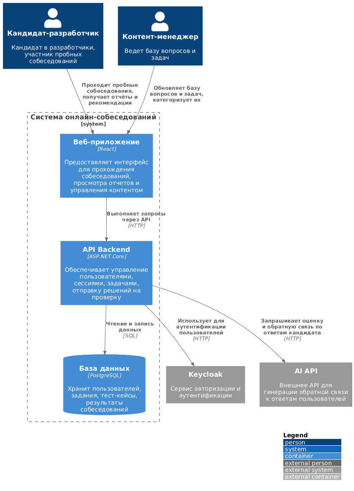
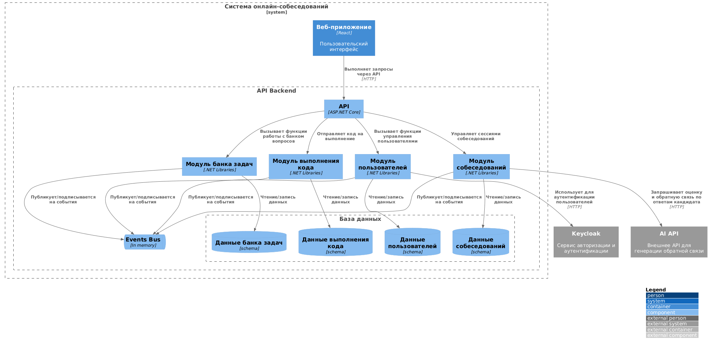
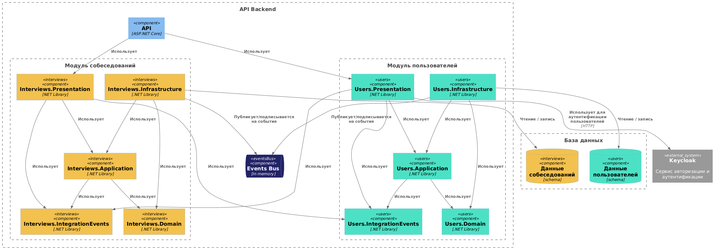

# Лабораторная работа №2

**Тема:** Использование нотации C4 model для проектирования архитектуры программной системы

**Цель работы:** Получить опыт использования графической нотации для фиксации архитектурных решений.

## Диаграмма системного контекста

### Описание основных элементов

1. Кандидат-разработчик (Person) - Основной пользователь системы. Проходит пробные собеседования, отвечает на вопросы и решает задачи, получает оценку навыков и обратную связь.

2. Контент-менеджер (Person) - Отвечает за наполнение базы заданий. Создаёт, редактирует и категоризует вопросы и задачи, используемые в собеседованиях

3. Система онлайн-собеседований (System) - веб-приложение, обеспечивающее:

   - проведение тренировочных собеседований
   - отображение вопросов и задач
   - прием и проверку решений
   - формирование отчётов и рекомендаций для пользователя

4. Keycloak (External System) - Внешняя система аутентификации и авторизации. Используется для входа пользователей в систему и управления их учетными данными.

5. AI API (External System) - Сторонний сервис, который выполняет анализ ответов пользователей, оценивает их, генерирует обратную связь по выполненным заданиям.

## Диаграмма контейнеров

### Описание контейнеров

1. Веб-приложение (React) - Фронтенд-контейнер, реализующий пользовательский интерфейс системы. Обеспечивает прохождение собеседований, отображение задач, ввод ответов, вывод обратной связи и инструменты для контент-менеджера. Взаимодействует с бэкендом через HTTP-запросы

2. API Backend (ASP.NET Core) - контейнер, реализующий бизнес-логику системы. Отвечает за управление пользователями, сессиями собеседований, вопросами, тест-кейсами и сохранение результатов. Обрабатывает решения кандидатов и взаимодействует с внешними сервисами. Обеспечивает доступ к базе данных.

3. База данных (PostgreSQL) - Хранилище данных системы. Содержит сведения о пользователях, списке задач, тест-кейсов, результатах собеседований. Используется API Backend’ом для чтения и записи данных.

### Архитектурный стиль

1.  Базовый архитектурный стиль:

    **Клиент-сервер:** фронтенд общается с серверным API по сети через HTTP

    - Клиент отвечает за представление данных и взаимодействие с пользователем
    - Сервер отвечает за обработку бизнес-логики, хранение данных и взаимодействие с внешними сервисами
    - Такое разделение обеспечивает:

      - независимое развитие фронтенда и бекенда
      - упрощённое сопровождение и тестирование
      - возможность подключения внешних сервисов без изменения клиентской части

2.  Архитектура уровня приложений:

    **Модульный монолит:** весь бэкенд разворачивается как один контейнер, но внутри логически разделён на модули:

    - модуль управления пользователями
    - модуль собеседований
    - модуль управления банком задач
    - модуль выполнения кода

    Плюсы выбранной архитектуры:

    - **логическая изоляция модулей**: изменения в одном модуле не влияют напрямую на остальные, упрощая разработку и тестирование
    - **упрощенное развертывание**: бэкенд разворачивается как один контейнер, что снижает сложность инфраструктуры
    - **возможность будущего масштабирования**: при повышении нагрузки отдельные модули можно постепенно выделять в отдельные сервисы (микросервисы)

3.  Развертывание:

    Разные модули развертываются отдельно:

    - Веб-приложение (React)
    - API Backend (модульный монолит)
    - База данных (PostgreSQL)
    - Внешние сервисы (Keycloak и AI API)

    Между контейнерами осуществляется сетевое взаимодействие

## Диаграмма компонентов (API Backend)

### Описание компонентов

1. Модуль пользователей - Отвечает за управление регистрацией, авторизацией, ролями пользователей

2. Модуль банка задач - Обеспечивает выполнение CRUD-операций для вопросов и задач

3. Модуль собеседований - Организует проведение сессий собеседований и работу с результатами

4. Модуль выполнения кода - Выполняет код пользователей (решение алгоритмических задач) и ставит вердикт

5. База данных - Хранит данные всех модулей

6. Events Bus - Обеспечивает обмен событиями между модулями (асинхронная коммуникация)

## Диаграмма компонентов (Модули)

### Описание компонентов

**API** - основная точка входа (ASP.NET Core приложение). Принимает запросы и передает их в соответствующий модуль

Каждый модуль реализует **чистую архитектуру** и состоит из подмодулей:

1. **Presentation** – слой контроллеров и эндпоинтов, обрабатывает HTTP-запросы от клиента, выполняет валидацию и вызывает бизнес-логику

2. **Application** – бизнес-логика, реализация юзкейсов, координация работы домена и инфраструктуры

3. **Domain** – сущности и правила домена, чистая бизнес-логика без зависимостей от инфраструктуры

4. **Infrastructure** – реализация доступа к данным, репозитории, интеграция с внешними сервисами и шиной событий

5. **IntegrationEvents** – описание DTO событий для публикации и обработки через шину событий. Только эта сборка может вызываться другими модулями
