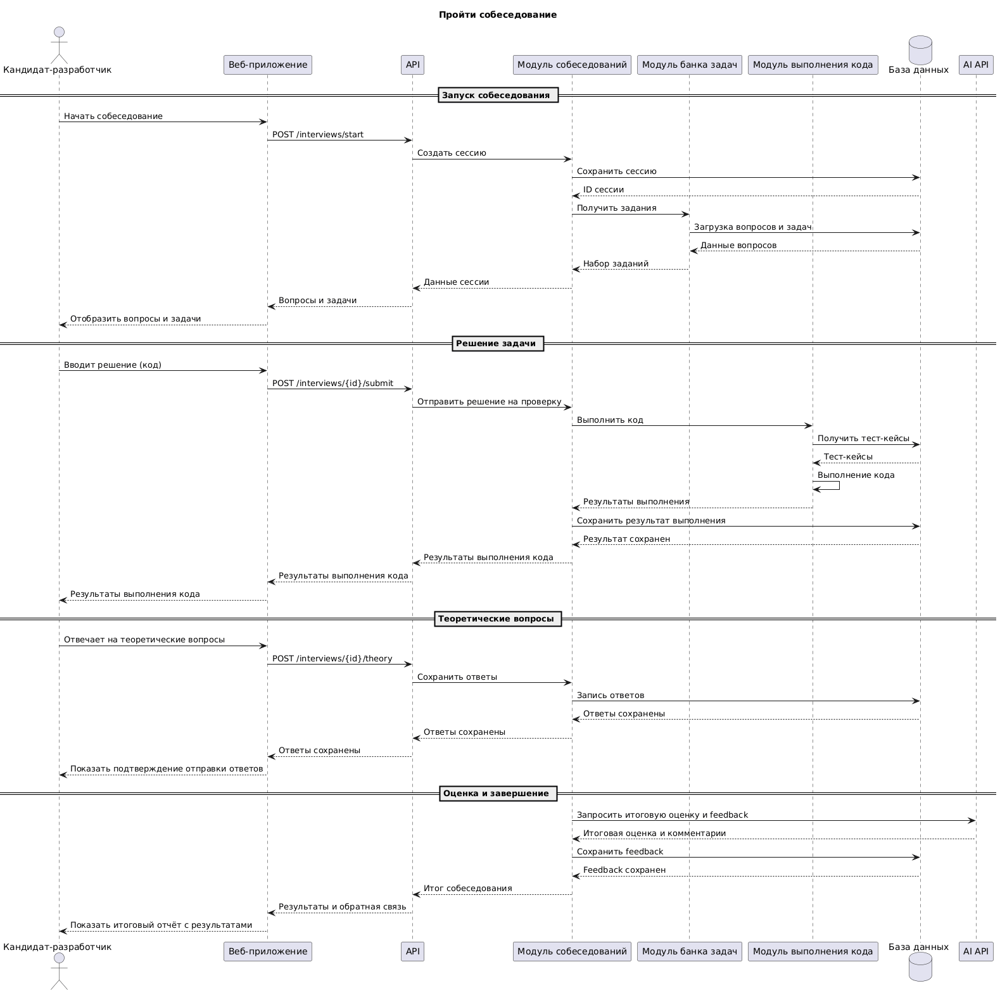
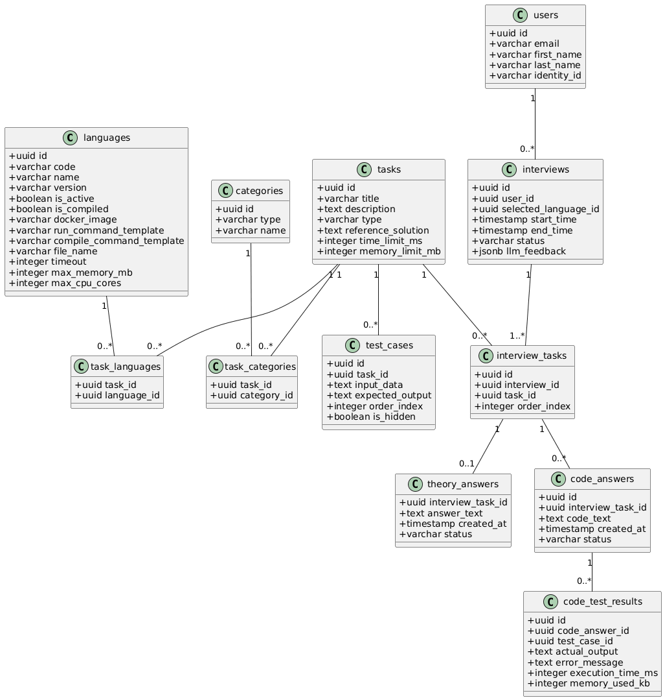

# Лабораторная работа №3

**Тема:** Использование принципов проектирования на уровне методов и классов

**Цель работы:** Получить опыт проектирования и реализации модулей с использованием принципов KISS, YAGNI, DRY, SOLID и др.

## Диаграмма контейнеров


## Диаграмма компонентов (Бэкенд)


### Описание компонентов

1. Модуль пользователей - Отвечает за управление регистрацией, авторизацией, ролями пользователей

2. Модуль банка задач - Обеспечивает выполнение CRUD-операций для вопросов и задач

3. Модуль собеседований - Организует проведение сессий собеседований и работу с результатами

4. Модуль выполнения кода - Выполняет код пользователей (решение алгоритмических задач) и ставит вердикт

5. База данных - Хранит данные всех модулей

6. Events Bus - Обеспечивает обмен событиями между модулями (асинхронная коммуникация)

## Диаграмма последовательностей

Выбранный UseCase - Пройти собеседование



Диаграмма последовательностей описывает вариант использования «Пройти собеседование».

Кандидат инициирует собеседование через веб-приложение, после чего API создаёт сессию и запрашивает задания из модуля банка задач.

В ходе собеседования кандидат решает алгоритмические задачи, которые выполняются модулем выполнения кода с использованием тест-кейсов.
Также кандидат отвечает на теоретические вопросы, ответы которых сохраняются в системе.

После завершения собеседования модуль собеседований агрегирует результаты выполнения кода и теоретические ответы и отправляет их во внешний AI API для получения итоговой оценки и обратной связи.

Финальные результаты сохраняются в базе данных и отображаются пользователю в виде отчёта.

## Модель БД



Система хранит пользователей и языки программирования, задачи с лимитами по времени и памяти, а также категории. Задачи могут поддерживать несколько языков и принадлежать нескольким категориям. Интервью проводятся для конкретного пользователя с выбранным языком и включают одну или несколько задач в определённом порядке. Каждая задача может иметь тест-кейсы, теоретический ответ и несколько кодовых попыток. Кодовые ответы проверяются тестами, и для каждой попытки хранятся результаты с выводом, ошибками, временем выполнения и использованием памяти.

## Применение основных принципов разработки

### 1. KISS

Это принцип проектирования и разработки, призывающий создавать простые и понятные решения, избегая избыточной сложности.

Пример: получение собеседования по Id. Нет лишних проверок, методов, или логики – только то, что нужно для извлечения интервью.

```csharp
public class GetInterviewByIdQueryHandler : IQueryHandler<GetInterviewByIdQuery, InterviewDto>
{
    private readonly IInterviewDbContext _dbContext;

    public GetInterviewByIdQueryHandler(IInterviewDbContext dbContext)
    {
        _dbContext = dbContext;
    }

    public async Task<InterviewDto> Handle(GetInterviewByIdQuery query, CancellationToken cancellationToken)
    {
        // простая логика: извлечение интервью по Id
        var interview = await _dbContext.Interviews
            .Include(i => i.Tasks)
            .SingleOrDefaultAsync(i => i.Id == query.Id, cancellationToken);

        if (interview == null) return null;

        return new InterviewDto
        {
            Id = interview.Id,
            UserId = interview.UserId,
            Status = interview.Status,
            TaskCount = interview.Tasks.Count
        };
    }
}

```

### 2. YAGNI

Суть: не писать код «на будущее», не тратить время и ресурсы на реализацию функциональности, которая не требуется для текущей задачи.

Пример: регистрация пользователя. Реализован минимально необходимый функционал для регистрации. Уведомления о регистрации пока не нужны, поэтому не реализуем их заранее

```csharp
public async Task<Result<Guid>> Handle(RegisterUserCommand command, CancellationToken cancellationToken)
{
    var result = await _identityProviderService.RegisterUserAsync(
        new UserModel(command.Email, command.Password, command.FirstName, command.LastName),
        cancellationToken);

    if (result.IsFailure)
    {
        return Result.Failure<Guid>(result.Error);
    }

    var user = User.Create(command.Email, command.FirstName, command.LastName, result.Value);

    await _dbContext.Users.AddAsync(user, cancellationToken);
    await _dbContext.SaveChangesAsync(cancellationToken);

    // уведомления пользователю пока не нужны, поэтому не реализуем их заранее
    // в будущем можно добавить INotificationService для отправки приветственного email или SMS

    return user.Id;
}
```

### 3. DRY

Принцип разработки программного обеспечения, направленный на минимизацию дублирования кода.

Пример: для представления результата выполнения какой-либо операции в бизнес-логике используется объект класса Result, который содержит свойство IsSuccess, поле Value с результатом (для Result<T>) и объект Error, если операция завершилась неудачей.

Чтобы избежать дублирования кода в контроллерах при конвертации ошибок в HTTP-ответы, создан метод расширения ToProblem(). Он проверяет тип ошибки и возвращает соответствующий IActionResult:

```csharp
public static IActionResult ToProblem<T>(this Result<T> result)
{
    if (result.IsSuccess)
        throw new InvalidOperationException("Cannot convert a successful Result to a Problem");

    return result.Error.Type switch
    {
        ErrorType.NotFound => new NotFoundObjectResult(result.Error),
        ErrorType.Validation => new BadRequestObjectResult(result.Error),
        ErrorType.Problem => new BadRequestObjectResult(result.Error),
        ErrorType.Conflict => new ConflictObjectResult(result.Error),
        _ => new BadRequestObjectResult(result.Error)
    };
}
```

Использование в контроллерах:

```csharp
[HttpPost("test-code")]
public async Task<IActionResult> TestCode([FromBody] TestCodeRequest request, CancellationToken cancellationToken)
{
    var command = new TestCodeCommand(request.Code, request.Language, request.TestCases, request.MaxTimeSeconds, request.MaxMemoryMb);
    var result = await _testCodeCommandHandler.Handle(command, cancellationToken);
    return result.IsSuccess
        ? Ok(result.Value)
        : result.ToProblem(); // DRY: вся логика обработки ошибок вынесена в метод расширения
}
```

Принцип DRY соблюдается: повторяющаяся логика обработки ошибок вынесена в отдельный метод расширения и используется повторно во всех контроллерах.

### 4. SOLID

#### 1. Single Responsibility Principle (Принцип единственной ответственности)

Метод ToProblem (приведен в демонстрации принципа DRY) выполняет единственную ответственность: преобразование объекта Result с ошибкой в корректный IActionResult.

Он не занимается выполнением бизнес-логики, проверкой данных или сохранением в базе. Его единственная цель — конвертировать ошибку в HTTP-ответ.

Любое изменение формата HTTP-ответа или добавление нового типа ошибки влияет только на этот метод, а не на остальной код.

#### 2. Open-Closed Principle (Принцип открытости-закрытости)

```csharp
private static void AddCommandHandlers(this IServiceCollection services, Assembly[] assemblies)
{
    //... остальной код

    services.Decorate(typeof(ICommandHandler<>), typeof(CommandValidationDecorator<>));
    services.Decorate(typeof(ICommandHandler<,>), typeof(CommandValidationDecorator<,>));
}
```

ICommandHandler — интерфейс для обработчиков команд, который реализует обработку одного use case в системе. Он принимает команду и выполняет бизнес-логику.

CommandValidationDecorator — это декоратор для обработчиков команд, который добавляет валидацию команды перед выполнением основной логики.

Применение OCP: Декоратор расширяет поведение хендлера без изменения его кода. Если потребуется добавить логирование, кэширование или проверку прав доступа, достаточно создать новый декоратор и зарегистрировать его через services.Decorate().

#### 3. Liskov Substitution Principle (Принцип подстановки Барбары Лисков)

```csharp
// интерфейс
public interface ICommandHandler<in TCommand, TResponse>
{
    Task<Result<TResponse>> Handle(TCommand command, CancellationToken cancellationToken);
}
```

```csharp
// хендлер
public class TestCodeCommandHandler : ICommandHandler<TestCodeCommand, TestResult>
{
    public async Task<Result<TestResult>> Handle(TestCodeCommand command, CancellationToken cancellationToken)
    {
        // бизнес-логика
        return testResult;
    }
}
```

```csharp
// контроллер
[ApiController]
[Route("api/[controller]")]
public class CodeController : ControllerBase
{
    private readonly ICommandHandler<TestCodeCommand, TestResult> _testCodeCommandHandler;

    public CodeController(ICommandHandler<TestCodeCommand, TestResult> testCodeCommandHandler)
    {
        _testCodeCommandHandler = testCodeCommandHandler;
    }

    [HttpPost("test-code")]
    public async Task<IActionResult> TestCode([FromBody] TestCodeRequest request, CancellationToken cancellationToken)
    {
        var command = new TestCodeCommand(request.Code, request.Language, request.TestCases, request.MaxTimeSeconds, request.MaxMemoryMb);
        var result = await _testCodeCommandHandler.Handle(command, cancellationToken);
        return result.IsSuccess ? Ok(result.Value) : result.ToProblem();
    }
}
```

LSP: контроллер работает с интерфейсом ICommandHandler<TestCodeCommand, TestResult> и может использовать любую реализацию хендлера без изменения собственного кода. Таким образом, конкретный хендлер полностью заменяет базовый тип (интерфейс) без нарушения работы приложения.

#### 4. Interface Segregation Principle (Принцип разделения интерфейса)

```csharp
// Интерфейс для работы с контекстом выполнения кода
public interface ICodeRunnerDbContext
{
    DbSet<Language> Languages { get; }

    Task<int> SaveChangesAsync(CancellationToken cancellationToken = default);
}

// Интерфейс для выполнения кода
public interface ICodeExecutor
{
    Task<CodeExecutionResult> ExecuteCode( Language language, string code, string input, CancellationToken cancellationToken = default);
}
```

ICodeRunnerDbContext предоставляет только свойства и методы, необходимые для работы с языками программирования и сохранения данных, а ICodeExecutor отвечает только за выполнение кода.
Хендлеры и другие сервисы зависят только от тех интерфейсов, которые им реально нужны

#### 5. Dependency Inversion Principle (Принцип инверсии зависимостей)

```csharp
// Хендлер зависит от абстракций (интерфейсов), а не от конкретных реализаций
public class TestCodeCommandHandler : ICommandHandler<TestCodeCommand, TestResult>
{
    private readonly ICodeExecutor _codeExecutor;
    private readonly ICodeRunnerDbContext _dbContext;

    public TestCodeCommandHandler(ICodeExecutor codeExecutor, ICodeRunnerDbContext dbContext)
    {
        _codeExecutor = codeExecutor;
        _dbContext = dbContext;
    }

    public Task<Result<TestResult>> Handle(TestCodeCommand command, CancellationToken cancellationToken)
    {
        // бизнес-логика
        return testResult;
    }
}
```

В примере TestCodeCommandHandler (высокоуровневый модуль) не зависит от конкретной реализации выполнения кода или контекста БД, а использует только интерфейсы ICodeExecutor и ICodeRunnerDbContext.

## Дополнительные принципы разработки

### BDUF. Big design up front («Масштабное проектирование прежде всего»)

Применен частично: построены диаграмма контекста, контейнеров, компонентов, схема БД, однако полное BDUF не применялось, так как так как система разрабатывается итеративно и с возможностью изменения требований. Слишком детальное проектирование может привести к избыточности работ, замедлить внедрение новых функций.

### SoC. Separation оf concerns (принцип разделения ответственности)

Применен: проект разделен на модули, которые в свою очередь разделены на слои Presentation / Application / Domain / Infrastructure. Каждый модуль или слой отвечает за свою отдельную задачу.

### MVP. Minimum viable product (минимально жизнеспособный продукт)

Применяется, так как разрабатывается продукт с минимальной функциональностью, достаточной для тестирования гипотез. Например, в первой версии не будет поддержки задач на SQL или системный дизайн, административной панели управления контентом.

### PoC. Proof of concept (доказательство концепции)

Не применяется в полной мере, так как вместо быстрого прототипа реализуется структурированный проект с использованием модульной, чистой архитектуры. Основная цель — сразу получить поддерживаемую и расширяемую систему, а не просто проверить концепцию. Однако принцип может быть использован для проверки отдельных модулей, например, модуля выполнения кода, чтобы убедиться, что механизм проверки решений пользователей работает корректно, прежде чем интегрировать его в систему.
