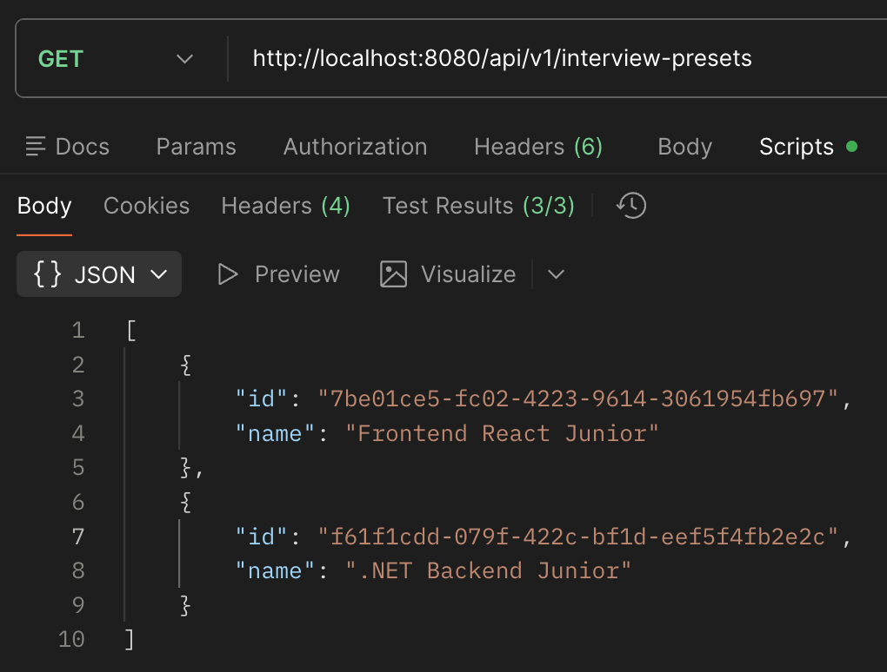
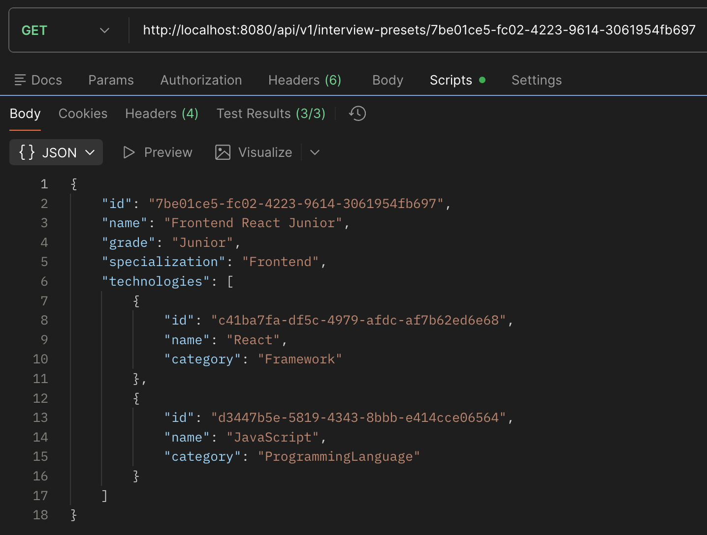
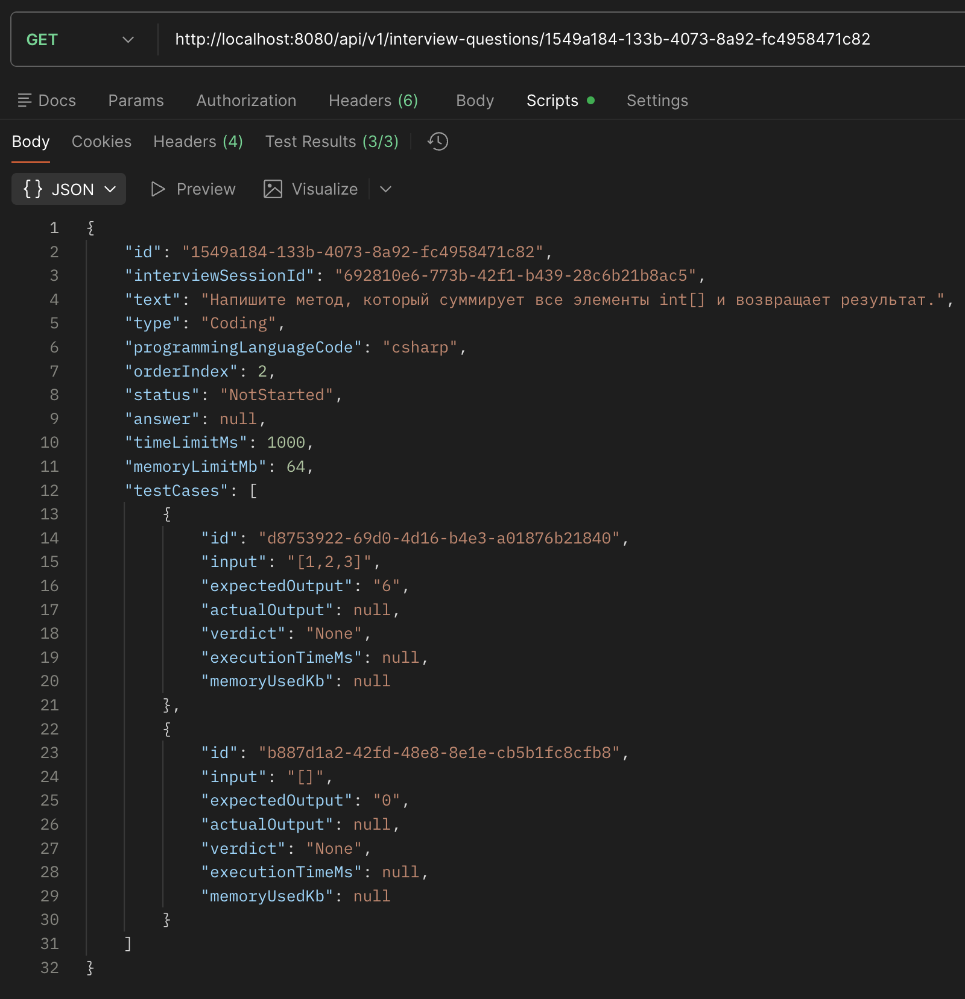
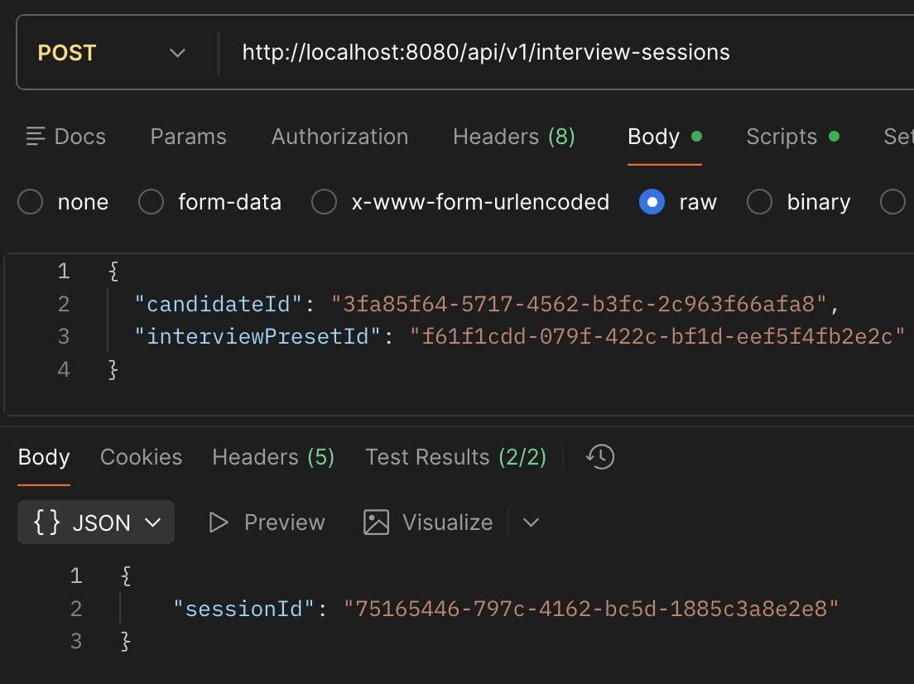
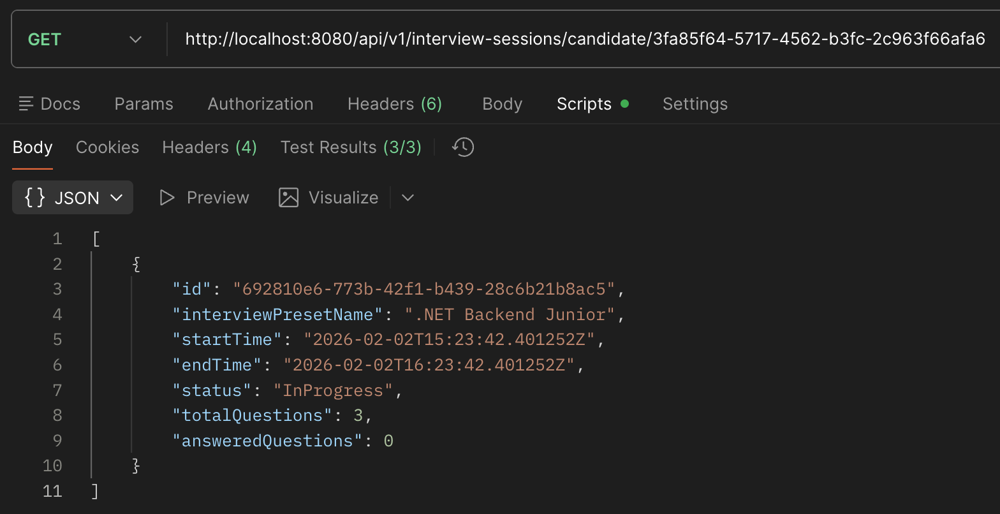
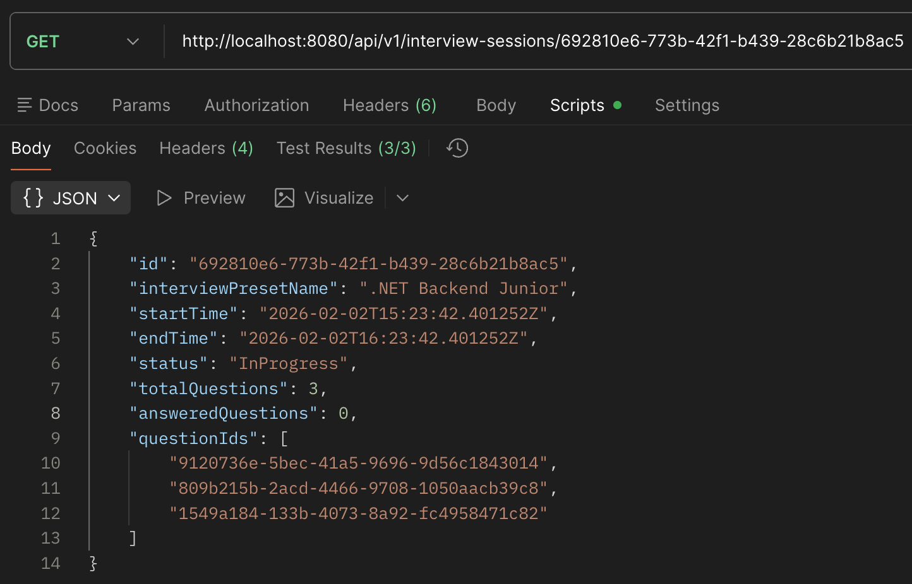
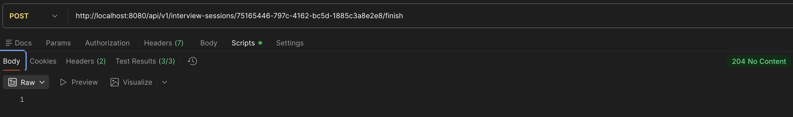
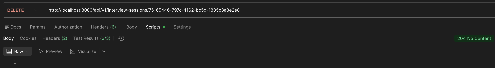

# Лабораторная работа №4

**Тема:** Проектирование REST API

**Цель работы:** Получить опыт проектирования программного интерфейса.

## Документация по API

### 1. Пресеты интервью

#### 1.1. Получить все пресеты

**`GET /api/v1/interview-presets`**

**Описание:**
Возвращает список всех пресетов интервью

**Параметры:** Без параметров

**Ответ 200 OK**

- **Тип:** JSON
- **Описание:** Список пресетов, каждый пресет содержит `id` и `name`

**Пример ответа:**

```json
[
  {
    "id": "7be01ce5-fc02-4223-9614-3061954fb697",
    "name": "Frontend React Junior"
  },
  {
    "id": "f61f1cdd-079f-422c-bf1d-eef5f4fb2e2c",
    "name": ".NET Backend Junior"
  }
]
```

- `id` — уникальный идентификатор пресета (string, UUID)
- `name` — название пресета (string)

#### 1.2. Получить пресет по ID

**`GET /api/v1/interview-presets/{id}`**

**Описание:**
Возвращает детальную информацию о пресете интервью по его уникальному идентификатору

**Параметры:**

- `id` — уникальный идентификатор пресета (string, UUID)

**Ответ 200 OK**

- **Тип:** JSON
- **Описание:** Детальная информация о пресете, включая название, уровень, специализацию и технологии

**Пример ответа:**

```json
{
  "id": "7be01ce5-fc02-4223-9614-3061954fb697",
  "name": "Frontend React Junior",
  "grade": "Junior",
  "specialization": "Frontend",
  "technologies": [
    {
      "id": "c41ba7fa-df5c-4979-afdc-af7b62ed6e68",
      "name": "React",
      "category": "Framework"
    },
    {
      "id": "d3447b5e-5819-4343-8bbb-e414cce06564",
      "name": "JavaScript",
      "category": "ProgrammingLanguage"
    }
  ]
}
```

- `id` — уникальный идентификатор пресета (string, UUID)
- `name` — название пресета (string)
- `grade` — уровень кандидата (Junior, Middle, Senior)
- `specialization` — специализация кандидата (string)
- `technologies` — список технологий, каждая содержит:
  - `id` — уникальный идентификатор технологии (string, UUID)
  - `name` — название технологии (string)
  - `category` — категория технологии (string, одно из: ProgrammingLanguage, Framework, ORM, Library, Tool, Database)

**Ответ 404 Not Found**

- **Тип:** JSON
- **Описание:** Ошибка, если пресет с указанным ID не найден

**Пример ответа:**

```json
{
  "code": "PRESET_NOT_FOUND",
  "description": "Пресет интервью не найден"
}
```

#### 2. Вопросы интервью

##### 2.1. Получить вопрос по ID

**`GET /api/v1/interview-questions/{id}`**

**Описание:**
Возвращает информацию о вопросе интервью по его идентификатору, включая текст, тип, ограничения по времени и памяти, а также тестовые кейсы. Используется во время прохождения сессии или для просмотра завершённых вопросов.

**Параметры:**

- `id` — уникальный идентификатор вопроса (string, UUID)

**Ответ 200 OK**

- **Тип:** JSON
- **Описание:** Детальная информация о вопросе

**Поля ответа:**

| Поле                      | Тип                            | Описание                                                                                                        |
| ------------------------- | ------------------------------ | --------------------------------------------------------------------------------------------------------------- |
| `id`                      | string (UUID)                  | Уникальный идентификатор вопроса                                                                                |
| `interviewSessionId`      | string (UUID)                  | Идентификатор сессии, к которой относится вопрос                                                                |
| `text`                    | string                         | Текст вопроса                                                                                                   |
| `type`                    | string (`Theory` или `Coding`) | Тип вопроса: теория или кодинг                                                                                  |
| `programmingLanguageCode` | string или null                | Код языка программирования для кодингового вопроса (например, `"csharp"`); null для теории                      |
| `orderIndex`              | number                         | Порядковый номер вопроса в сессии                                                                               |
| `status`                  | string                         | Текущий статус вопроса (`NotStarted`, `InProgress`, `Submitted`, `EvaluatingCode`, `EvaluatingAi`, `Evaluated`) |
| `answer`                  | string или null                | Текущий ответ кандидата на вопрос                                                                               |
| `timeLimitMs`             | number или null                | Ограничение времени на выполнение кода (в миллисекундах); null для теоретических вопросов                       |
| `memoryLimitMb`           | number или null                | Ограничение памяти на выполнение кода (в мегабайтах); null для теоретических вопросов                           |
| `testCases`               | массив TestCaseDto             | Список тестовых кейсов для кодингового вопроса (пустой для теоретических)                                       |

**Структура TestCaseDto:**

| Поле              | Тип             | Описание                                                                                |
| ----------------- | --------------- | --------------------------------------------------------------------------------------- |
| `id`              | string (UUID)   | Уникальный идентификатор теста                                                          |
| `input`           | string          | Входные данные для теста                                                                |
| `expectedOutput`  | string          | Ожидаемый результат теста                                                               |
| `actualOutput`    | string или null | Результат, полученный от кандидата (null до отправки)                                   |
| `verdict`         | string          | Вердикт выполнения теста (`None`, `OK`, `WA`, `CE`, `RE`, `TLE`, `MLE`, `FailedSystem`) |
| `executionTimeMs` | number или null | Время выполнения теста в миллисекундах                                                  |
| `memoryUsedKb`    | number или null | Использованная память в килобайтах                                                      |

**Пример ответа (кодинговый вопрос):**

```json
{
  "id": "1549a184-133b-4073-8a92-fc4958471c82",
  "interviewSessionId": "692810e6-773b-42f1-b439-28c6b21b8ac5",
  "text": "Напишите метод, который суммирует все элементы int[] и возвращает результат.",
  "type": "Coding",
  "programmingLanguageCode": "csharp",
  "orderIndex": 2,
  "status": "NotStarted",
  "answer": null,
  "timeLimitMs": 1000,
  "memoryLimitMb": 64,
  "testCases": [
    {
      "id": "d8753922-69d0-4d16-b4e3-a01876b21840",
      "input": "[1,2,3]",
      "expectedOutput": "6",
      "actualOutput": null,
      "verdict": "None",
      "executionTimeMs": null,
      "memoryUsedKb": null
    },
    {
      "id": "b887d1a2-42fd-48e8-8e1e-cb5b1fc8cfb8",
      "input": "[]",
      "expectedOutput": "0",
      "actualOutput": null,
      "verdict": "None",
      "executionTimeMs": null,
      "memoryUsedKb": null
    }
  ]
}
```

**Пример ответа (теоретический вопрос):**

```json
{
  "id": "9120736e-5bec-41a5-9696-9d56c1843014",
  "interviewSessionId": "692810e6-773b-42f1-b439-28c6b21b8ac5",
  "text": "Объясните разницу между List<T> и IEnumerable<T>.",
  "type": "Theory",
  "programmingLanguageCode": null,
  "orderIndex": 0,
  "status": "NotStarted",
  "answer": null,
  "timeLimitMs": null,
  "memoryLimitMb": null,
  "testCases": []
}
```

**Ответ 404 Not Found**

- **Тип:** JSON
- **Описание:** Ошибка, если вопрос с указанным ID не найден

**Пример ответа:**

```json
{
  "code": "QUESTION_NOT_FOUND",
  "description": "Вопрос не найден"
}
```

### 3. Сессии интервью

#### 3.1. Создать сессию интервью

**`POST /api/v1/interview-sessions`**

**Описание:**
Создаёт новую сессию интервью для кандидата по выбранному пресету. Если у кандидата уже есть активная сессия, создание невозможно.

**Параметры:**

- **Request Body (JSON)**

| Поле                | Тип           | Описание                       |
| ------------------- | ------------- | ------------------------------ |
| `candidateId`       | string (UUID) | Идентификатор кандидата        |
| `interviewPresetId` | string (UUID) | Идентификатор пресета интервью |

**Пример запроса:**

```json
{
  "candidateId": "3fa85f64-5717-4562-b3fc-2c963f66afa6",
  "interviewPresetId": "f61f1cdd-079f-422c-bf1d-eef5f4fb2e2c"
}
```

**Ответ 201 Created**

- **Тип:** JSON
- **Описание:** Уникальный идентификатор созданной сессии

```json
{
  "sessionId": "692810e6-773b-42f1-b439-28c6b21b8ac5"
}
```

**Ответ 422 Unprocessable Entity**

- **Тип:** JSON
- **Описание:** Ошибка, если у кандидата уже есть активная сессия

```json
{
  "code": "ACTIVE_SESSION_EXISTS",
  "description": "У кандидата уже есть активная сессия интервью"
}
```

**Ответ 404 Not Found**

- **Тип:** JSON
- **Описание:** Ошибка, если пресет с указанным `interviewPresetId` не найден

```json
{
  "code": "PRESET_NOT_FOUND",
  "description": "Пресет интервью не найден"
}
```

#### 3.2. Получить все сессии кандидата

**`GET /api/v1/interview-sessions/candidate/{candidateId}`**

**Описание:**
Возвращает список всех сессий интервью для указанного кандидата

**Параметры:**

| Поле          | Тип           | Описание                |
| ------------- | ------------- | ----------------------- |
| `candidateId` | string (UUID) | Идентификатор кандидата |

**Ответ 200 OK**

- **Тип:** JSON
- **Описание:** Список сессий кандидата. Каждая сессия содержит:

| Поле                  | Тип           | Описание                                                                 |
| --------------------- | ------------- | ------------------------------------------------------------------------ |
| `id`                  | string (UUID) | Идентификатор сессии                                                     |
| `interviewPresetName` | string        | Название пресета интервью                                                |
| `startTime`           | string        | Время начала сессии                                                      |
| `endTime`             | string        | Время окончания сессии                                                   |
| `status`              | string        | Статус сессии (InProgress, Finished, Cancelled, EvaluatingAi, Evaluated) |
| `totalQuestions`      | number        | Общее количество вопросов в сессии                                       |
| `answeredQuestions`   | number        | Количество уже отвеченных вопросов                                       |

**Пример ответа:**

```json
[
  {
    "id": "692810e6-773b-42f1-b439-28c6b21b8ac5",
    "interviewPresetName": ".NET Backend Junior",
    "startTime": "2026-02-02T15:23:42.401252Z",
    "endTime": "2026-02-02T16:23:42.401252Z",
    "status": "InProgress",
    "totalQuestions": 3,
    "answeredQuestions": 0
  }
]
```

#### 3.3. Получить сессию интервью по ID

**`GET /api/v1/interview-sessions/{id}`**

**Описание:**
Возвращает информацию о конкретной сессии интервью по её идентификатору. Используется для просмотра прогресса прохождения собеседования кандидатом

**Параметры:**

| Поле | Тип           | Описание                      |
| ---- | ------------- | ----------------------------- |
| `id` | string (UUID) | Идентификатор сессии интервью |

**Ответ 200 OK**

- **Тип:** JSON
- **Описание:** Содержит данные сессии и список идентификаторов вопросов.

| Поле                  | Тип                  | Описание                                                                 |
| --------------------- | -------------------- | ------------------------------------------------------------------------ |
| `id`                  | string (UUID)        | Идентификатор сессии                                                     |
| `interviewPresetName` | string               | Название пресета интервью                                                |
| `startTime`           | string               | Время начала сессии                                                      |
| `endTime`             | string               | Время окончания сессии                                                   |
| `status`              | string               | Статус сессии (InProgress, Finished, Cancelled, EvaluatingAi, Evaluated) |
| `totalQuestions`      | number               | Общее количество вопросов в сессии                                       |
| `answeredQuestions`   | number               | Количество уже отвеченных вопросов                                       |
| `questionIds`         | массив string (UUID) | Список идентификаторов вопросов в порядке прохождения                    |

**Пример ответа:**

```json
{
  "id": "692810e6-773b-42f1-b439-28c6b21b8ac5",
  "interviewPresetName": ".NET Backend Junior",
  "startTime": "2026-02-02T15:23:42.401252Z",
  "endTime": "2026-02-02T16:23:42.401252Z",
  "status": "InProgress",
  "totalQuestions": 3,
  "answeredQuestions": 0,
  "questionIds": [
    "9120736e-5bec-41a5-9696-9d56c1843014",
    "809b215b-2acd-4466-9708-1050aacb39c8",
    "1549a184-133b-4073-8a92-fc4958471c82"
  ]
}
```

**Ответ 404 Not Found**

- **Тип:** JSON
- **Описание:** Ошибка, если сессия с указанным ID не найдена.

**Пример ответа:**

```json
{
  "code": "SESSION_NOT_FOUND",
  "description": "Сессия интервью не найдена"
}
```

#### 3.4. Завершение сессии интервью

**`POST /api/v1/interview-sessions/{sessionId}/finish`**

**Описание:**
Завершает активную сессию интервью. После вызова статус сессии меняется на `Finished`

**Параметры:**

| Поле        | Тип           | Описание                      |
| ----------- | ------------- | ----------------------------- |
| `sessionId` | string (UUID) | Идентификатор сессии интервью |

**Ответ 204 No Content**

- **Описание:** Сессия успешно завершена

**Ответ 422 Unprocessable Entity**

- **Описание:** Ошибка, если сессия уже завершена или отменена.

**Пример ответа:**

```json
{
  "code": "SESSION_NOT_ACTIVE",
  "description": "Сессия уже завершена или отменена"
}
```

**Ответ 404 Not Found**

- **Описание:** Ошибка, если сессия с указанным ID не найдена.

**Пример ответа:**

```json
{
  "code": "SESSION_NOT_FOUND",
  "description": "Сессия интервью не найдена"
}
```

#### 3.5. Удаление сессии интервью

**`DELETE /api/v1/interview-sessions/{id}`**

**Описание:**
Удаляет существующую сессию интервью по её идентификатору

**Параметры:**

| Поле | Тип           | Описание                      |
| ---- | ------------- | ----------------------------- |
| `id` | string (UUID) | Идентификатор сессии интервью |

**Ответ 204 No Content**

- **Описание:** Сессия успешно удалена

**Ответ 404 Not Found**

- **Описание:** Ошибка, если сессия с указанным ID не найдена.

**Пример ответа:**

```json
{
  "code": "SESSION_NOT_FOUND",
  "description": "Сессия интервью не найдена"
}
```

## Тестирование API

### 1. Пресеты интервью

#### 1.1. Получить все пресеты



**Код автотестов:**

```javascript
pm.test('Статус 200 OK', function () {
  pm.response.to.have.status(200);
});

pm.test('Ответ — массив', function () {
  var jsonData = pm.response.json();
  pm.expect(jsonData).to.be.an('array');
});

pm.test('Каждый пресет содержит id и name', function () {
  var jsonData = pm.response.json();
  jsonData.forEach(function (item) {
    pm.expect(item).to.have.property('id');
    pm.expect(item.id).to.be.a('string');
    pm.expect(item).to.have.property('name');
    pm.expect(item.name).to.be.a('string');
  });
});
```

#### 1.2. Получить пресет по ID



**Код автотестов:**

```javascript
var jsonData = pm.response.json();

if (pm.response.code === 200) {
  pm.test('Статус 200 OK', function () {
    pm.response.to.have.status(200);
  });

  pm.test(
    'Ответ содержит id, name, grade, specialization и technologies',
    function () {
      pm.expect(jsonData).to.have.property('id');
      pm.expect(jsonData.id).to.be.a('string');

      pm.expect(jsonData).to.have.property('name');
      pm.expect(jsonData.name).to.be.a('string');

      pm.expect(jsonData).to.have.property('grade');
      pm.expect(jsonData.grade).to.be.a('string');

      pm.expect(jsonData).to.have.property('specialization');
      pm.expect(jsonData.specialization).to.be.a('string');

      pm.expect(jsonData).to.have.property('technologies');
      pm.expect(jsonData.technologies).to.be.an('array').that.is.not.empty;
    },
  );

  pm.test('Проверка технологий', function () {
    jsonData.technologies.forEach(function (tech) {
      pm.expect(tech).to.have.property('id');
      pm.expect(tech.id).to.be.a('string');

      pm.expect(tech).to.have.property('name');
      pm.expect(tech.name).to.be.a('string');

      pm.expect(tech).to.have.property('category');
      pm.expect([
        'ProgrammingLanguage',
        'Framework',
        'ORM',
        'Library',
        'Tool',
        'Database',
      ]).to.include(tech.category);
    });
  });
}

if (pm.response.code === 404) {
  pm.test('Статус 404 Not Found', function () {
    pm.response.to.have.status(404);
  });

  pm.test('Ответ содержит code и description', function () {
    pm.expect(jsonData).to.have.property('code');
    pm.expect(jsonData.code).to.equal('PRESET_NOT_FOUND');

    pm.expect(jsonData).to.have.property('description');
    pm.expect(jsonData.description).to.be.a('string');
  });
}
```

### 2. Вопросы интервью

#### 1.2. Получить пресет по ID



**Код автотестов:**

```javascript
pm.test('Статус ответа 200', function () {
  pm.response.to.have.status(200);
});

pm.test('Поля вопроса присутствуют', function () {
  const json = pm.response.json();
  pm.expect(json).to.have.property('id');
  pm.expect(json).to.have.property('interviewSessionId');
  pm.expect(json).to.have.property('text');
  pm.expect(json).to.have.property('type');
  pm.expect(json).to.have.property('orderIndex');
  pm.expect(json).to.have.property('status');
  pm.expect(json).to.have.property('testCases');
});

pm.test('Типы полей корректные', function () {
  const json = pm.response.json();
  pm.expect(json.id).to.be.a('string');
  pm.expect(json.interviewSessionId).to.be.a('string');
  pm.expect(json.text).to.be.a('string');
  pm.expect(['Theory', 'Coding']).to.include(json.type);
  pm.expect(json.orderIndex).to.be.a('number');
  pm.expect(json.status).to.be.a('string');
  pm.expect(json.testCases).to.be.an('array');
});
```

### 3. Сессии интервью

#### 3.1. Создать сессию интервью



**Код автотестов:**

```javascript
pm.test('Статус 201 Created', function () {
  pm.response.to.have.status(201);
});

pm.test('sessionId присутствует', function () {
  const json = pm.response.json();
  pm.expect(json).to.have.property('sessionId');
  pm.expect(json.sessionId).to.be.a('string');
});
```

#### 3.2. Получить все сессии кандидата



**Код автотестов:**

```javascript
pm.test('Статус 200 OK', () => pm.response.to.have.status(200));

pm.test('Ответ — массив', () =>
  pm.expect(pm.response.json()).to.be.an('array'),
);

pm.test('Сессии содержат id и статус', () => {
  pm.response.json().forEach((s) => {
    pm.expect(s).to.have.property('id').that.is.a('string');
    pm.expect(s).to.have.property('status').that.is.a('string');
  });
});
```

#### 3.3. Получить сессию интервью по ID



**Код автотестов:**

```javascript
pm.test('Статус 200 OK', () => pm.response.to.have.status(200));

pm.test('Сессия содержит id, status и вопросы', () => {
  const json = pm.response.json();
  pm.expect(json).to.have.property('id').that.is.a('string');
  pm.expect(json).to.have.property('status').that.is.a('string');
  pm.expect(json).to.have.property('questionIds').that.is.an('array');
});

pm.test('Статус сессии валидный', () => {
  const allowed = [
    'InProgress',
    'Finished',
    'EvaluatingAi',
    'Evaluated',
    'Cancelled',
  ];
  const json = pm.response.json();
  pm.expect(allowed).to.include(json.status);
});
```

#### 3.4. Завершение сессии интервью



**Код автотестов:**

```javascript
pm.test('Статус 204 No Content', () => {
  pm.expect(pm.response.code).to.be.oneOf([204, 422, 404]);
});

pm.test('Проверка ошибки SESSION_NOT_ACTIVE', () => {
  if (pm.response.code === 422) {
    const json = pm.response.json();
    pm.expect(json).to.have.property('code', 'SESSION_NOT_ACTIVE');
  }
});

pm.test('Проверка ошибки SESSION_NOT_FOUND', () => {
  if (pm.response.code === 404) {
    const json = pm.response.json();
    pm.expect(json).to.have.property('code', 'SESSION_NOT_FOUND');
  }
});
```

#### 3.5. Удаление сессии интервью



**Код автотестов:**

```javascript
pm.test('Код ответа 204 или 404', () => {
  pm.expect(pm.response.code).to.be.oneOf([204, 404]);
});

pm.test('Проверка ошибки SESSION_NOT_FOUND', () => {
  if (pm.response.code === 404) {
    const json = pm.response.json();
    pm.expect(json).to.have.property('code', 'SESSION_NOT_FOUND');
  }
});

pm.test('Проверка пустого тела ответа при удалении', () => {
  if (pm.response.code === 204) {
    pm.expect(pm.response.text()).to.be.empty;
  }
});
```
