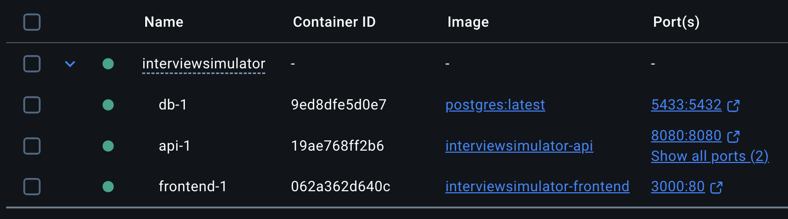
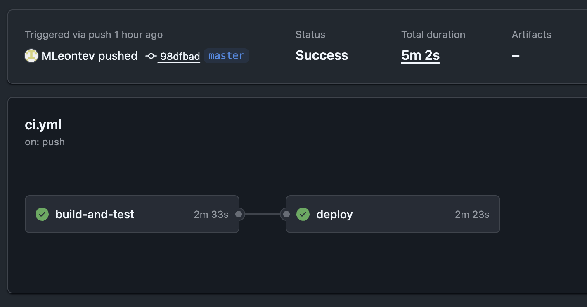
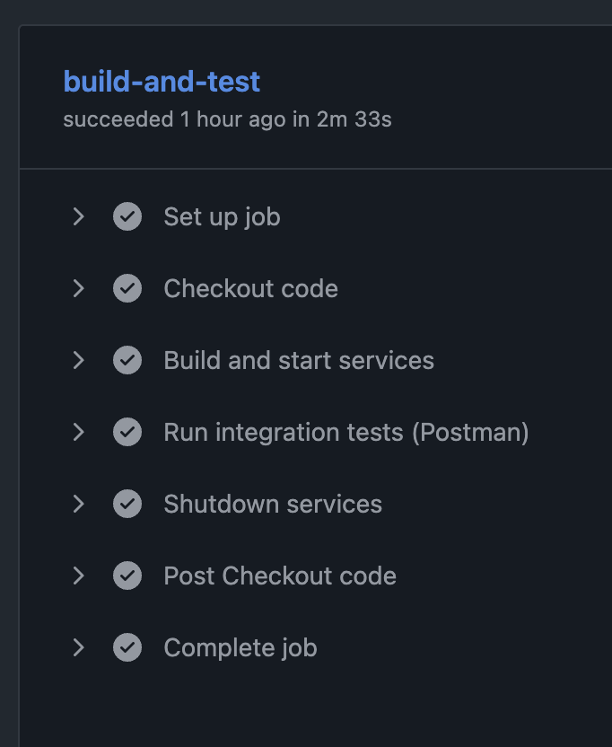
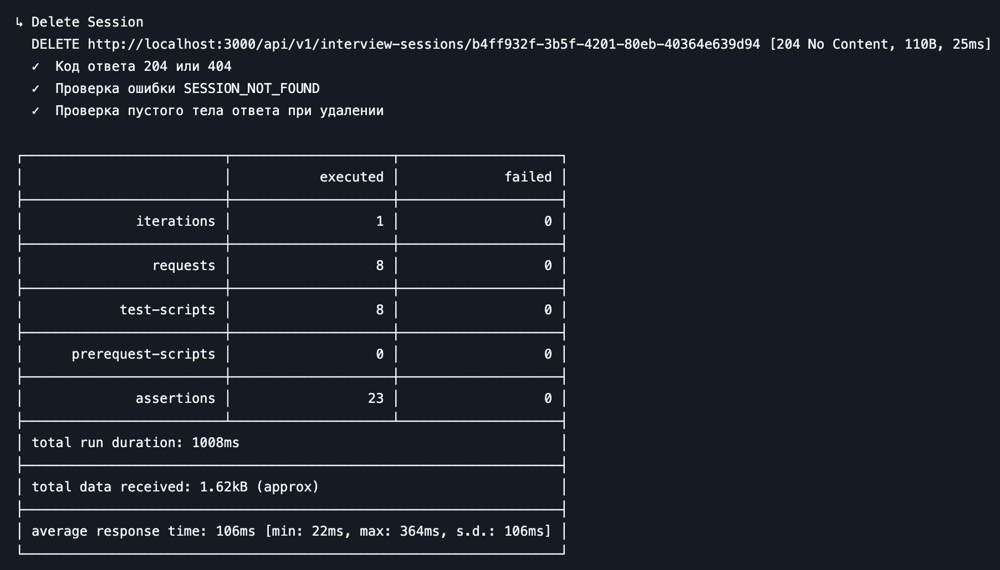
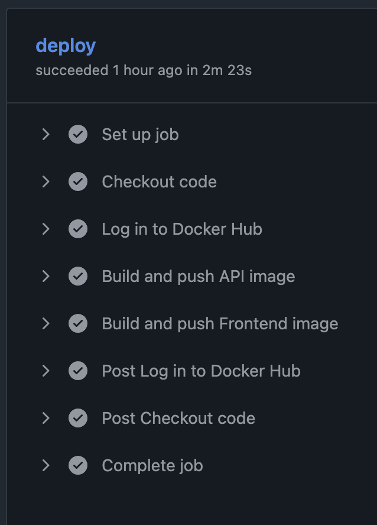

# Лабораторная работа №5

**Тема:** Реализация архитектуры на основе сервисов (микросервисной архитектуры)

**Цель работы:** Получить опыт работы организации взаимодействия сервисов с использованием контейнеров Docker

## Запуск контейнеров

Для запуска взаимодействующих контейнеров были реализованы:

- [Dockerfile для backend](../src/backend/Dockerfile)
- [Dockerfile для frontend](../src/frontend/Dockerfile)
- [Конфигурационный файл Nginx для frontend](../src/frontend/Dockerfile)
- [docker-compose](../src/docker-compose.yml)

Запущенные контейнеры:

## CI/CD (GitHub Actions)

Файл конфигурации: [ci.yml](../src/ci.yml)

При пуше в ветку master запускается workflow CI/CD:

**Job: build-and-test (Сборка и тестирование):**

- Шаги:
  - Checkout code – клонирует репозиторий
  - Build and start services – собирает все Docker-контейнеры и поднимает их (docker compose up -d --build)
  - Run integration tests (Postman) – устанавливает newman и запускает интеграционные тесты, проверяя работу API
  - Shutdown services – завершает работу контейнеров (docker compose down) даже в случае ошибки (if: always())

**Job: deploy (Развёртывание):**

- Запускается после успешного завершения build-and-test
- Шаги:
  - Checkout code – клонирует репозиторий
  - Log in to Docker Hub – авторизация в Docker Hub через секреты (DOCKER_USERNAME и DOCKER_PASSWORD)
  - Build and push API image – собирает Docker-образ бэкенда и публикует его на Docker Hub
  - Build and push Frontend image – собирает Docker-образ фронтенда и публикует его на Docker Hub

Результаты тестов (Postman):

