# Лабораторная работа №6

**Тема:** Использование шаблонов проектирования

**Цель работы:** Получить опыт применения шаблонов проектирования при написании кода программной системы

## Шаблоны проектирования GoF

### Порождающие шаблоны

#### 1. Singleton

**Общее назначение:**  
Обеспечить существование только одного экземпляра класса и единую точку доступа к нему

**Назначение в рамках проекта:**  
`RuntimeConfig`:

- Загружает конфигурацию `Runtimes` (описания окружений для запуска кода разных языков) из `IConfiguration` один раз и хранит её в `_languages`. Это обеспечивает:
  - единый источник правды по поддерживаемым рантаймам
  - отсутствие повторных чтений/парсинга конфигурации
  - согласованность данных для всех компонентов.

`LanguageProvider` использует один и тот же экземпляр `RuntimeConfig` и предоставляет единый сервис получения языков
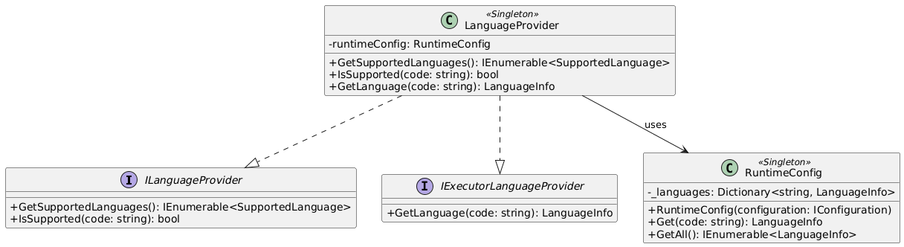

```csharp
internal class RuntimeConfig
{
    // методы
}

internal class LanguageProvider(RuntimeConfig runtimeConfig) : ILanguageProvider, IExecutorLanguageProvider
{
    // методы
}

public static IServiceCollection AddCodeExecutionDocker(this IServiceCollection services, IConfiguration configuration)
{
    services.AddSingleton(_ => new RuntimeConfig(configuration));
    services.AddSingleton<LanguageProvider>();

    services.AddSingleton<ILanguageProvider>(sp => sp.GetRequiredService<LanguageProvider>());
    services.AddSingleton<IExecutorLanguageProvider>(sp => sp.GetRequiredService<LanguageProvider>());

    services.AddScoped<ICodeExecutor, CodeExecutor>();

    return services;
}
```

#### 2. Prototype

**Общее назначение:**  
Позволяет создавать объекты на основе уже ранее созданных объектов-прототипов. Не через конструктор “с нуля”, а через клонирование заранее настроенного объекта-прототипа. Это снижает дублирование кода и упрощает создание сложных объектов с одинаковой базовой структурой.

**Назначение в рамках проекта:**  
В проекте `InterviewQuestionPrototype` формирует шаблон вопроса интервью из `InterviewQuestionApiDto`, а затем клонирует его для конкретной сессии (`CloneForSession`). При клонировании создаются новые `Id`, заполняются `InterviewSessionId` и `OrderIndex`, а также глубоко копируются `TestCases` с новыми идентификаторами. За счет этого `CreateInterviewSessionCommandHandler` собирает вопросы сессии без ручного повторения логики маппинга и инициализации состояния.

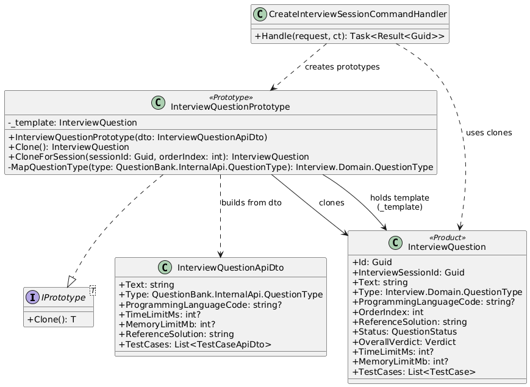

```csharp
public interface IPrototype<out T>
{
    T Clone();
}

internal sealed class InterviewQuestionPrototype : IPrototype<InterviewQuestion>
{
    private readonly InterviewQuestion _template;

    public InterviewQuestionPrototype(InterviewQuestionApiDto dto)
    {
        _template = new InterviewQuestion
        {
            Text = dto.Text,
            Type = MapQuestionType(dto.Type),
            ProgrammingLanguageCode = dto.ProgrammingLanguageCode,
            ReferenceSolution = dto.ReferenceSolution,
            Status = QuestionStatus.NotStarted,
            OverallVerdict = Verdict.None,
            TimeLimitMs = dto.TimeLimitMs,
            MemoryLimitMb = dto.MemoryLimitMb,
            TestCases = dto.TestCases
                .Select((tc, index) => new TestCase
                {
                    Input = tc.Input,
                    ExpectedOutput = tc.ExpectedOutput,
                    IsHidden = tc.IsHidden,
                    OrderIndex = index,
                    ActualOutput = null,
                    ExecutionTimeMs = null,
                    MemoryUsedKb = null,
                    Verdict = Verdict.None
                })
                .ToList()
        };
    }

    public InterviewQuestion Clone()
    {
        var questionId = Guid.NewGuid();

        return new InterviewQuestion
        {
            Id = questionId,
            Text = _template.Text,
            Type = _template.Type,
            ProgrammingLanguageCode = _template.ProgrammingLanguageCode,
            ReferenceSolution = _template.ReferenceSolution,
            Status = _template.Status,
            OverallVerdict = _template.OverallVerdict,
            TimeLimitMs = _template.TimeLimitMs,
            MemoryLimitMb = _template.MemoryLimitMb,
            TestCases = _template.TestCases
                .Select(tc => new TestCase
                {
                    Id = Guid.NewGuid(),
                    InterviewQuestionId = questionId,
                    Input = tc.Input,
                    ExpectedOutput = tc.ExpectedOutput,
                    IsHidden = tc.IsHidden,
                    OrderIndex = tc.OrderIndex,
                    ActualOutput = null,
                    ExecutionTimeMs = null,
                    MemoryUsedKb = null,
                    Verdict = Verdict.None
                })
                .ToList()
        };
    }

    public InterviewQuestion CloneForSession(Guid sessionId, int orderIndex)
    {
        var clone = Clone();
        clone.InterviewSessionId = sessionId;
        clone.OrderIndex = orderIndex;
        return clone;
    }
}

public record CreateInterviewSessionCommand(Guid CandidateId, Guid InterviewPresetId) : IRequest<Result<Guid>>;

internal class CreateInterviewSessionCommandHandler(
    IDbContext dbContext,
    IQuestionBankApi questionBankApi) : IRequestHandler<CreateInterviewSessionCommand, Result<Guid>>
{
    public async Task<Result<Guid>> Handle(CreateInterviewSessionCommand request, CancellationToken ct)
    {
        var questions = await questionBankApi.GetQuestionsAsync(
            request.InterviewPresetId,
            totalQuestions);

        var prototypes = questions
            .Select(q => new InterviewQuestionPrototype(q))
            .ToList();

        var interviewQuestions = prototypes
            .Select((prototype, index) => prototype.CloneForSession(sessionId, index))
            .ToList();

        var session = new InterviewSessionBuilder()
            .WithSessionId(sessionId)
            .ForCandidate(request.CandidateId)
            .WithPresetName(presetInfo.Name)
            .StartsAt(now)
            .WithDuration(TimeSpan.FromHours(1))
            .WithQuestions(interviewQuestions)
            .Build();

        await dbContext.InterviewSessions.AddAsync(session, ct);
        await dbContext.SaveChangesAsync(ct);

        return Result.Success(sessionId);
    }
}
```

#### 3. Builder

**Общее назначение:**  
Builder отделяет процесс пошагового создания сложного объекта от его финального представления. Он позволяет собирать объект последовательно и избегать громоздких конструкторов

**Назначение в рамках проекта:**  
В проекте `InterviewSessionBuilder` используется для поэтапной сборки объекта `InterviewSession` при создании интервью: установка идентификатора сессии, кандидата, названия пресета, времени начала/окончания, статуса и списка вопросов. Это упрощает код обработчика `CreateInterviewSessionCommandHandler` и централизует правила формирования сессии

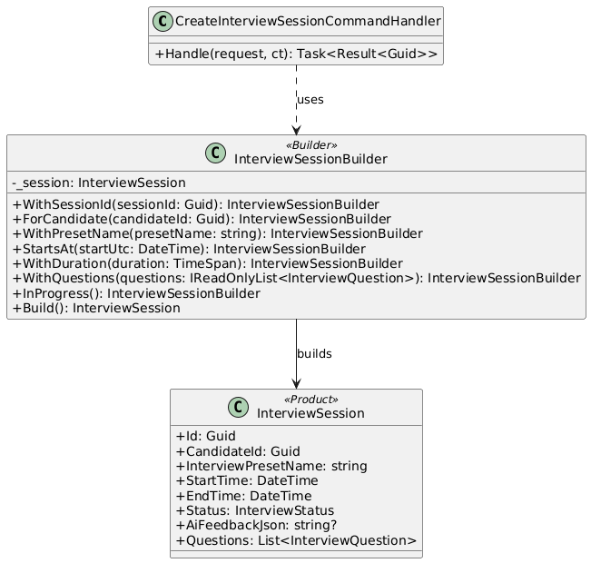

```csharp
internal sealed class InterviewSessionBuilder
{
    private readonly InterviewSession _session = new();

    public InterviewSessionBuilder WithSessionId(Guid sessionId)
    {
        _session.Id = sessionId;
        return this;
    }

    public InterviewSessionBuilder ForCandidate(Guid candidateId)
    {
        _session.CandidateId = candidateId;
        return this;
    }

    public InterviewSessionBuilder WithPresetName(string presetName)
    {
        _session.InterviewPresetName = presetName;
        return this;
    }

    public InterviewSessionBuilder StartsAt(DateTime startUtc)
    {
        _session.StartTime = startUtc;
        return this;
    }

    public InterviewSessionBuilder WithDuration(TimeSpan duration)
    {
        _session.EndTime = _session.StartTime.Add(duration);
        return this;
    }

    public InterviewSessionBuilder WithQuestions(IReadOnlyList<InterviewQuestion> questions)
    {
        _session.Questions = questions.ToList();
        return this;
    }

    public InterviewSessionBuilder InProgress()
    {
        _session.Status = InterviewStatus.InProgress;
        return this;
    }

    public InterviewSession Build()
    {
        if (_session.Id == Guid.Empty) throw new InvalidOperationException("SessionId is required.");
        if (_session.CandidateId == Guid.Empty) throw new InvalidOperationException("CandidateId is required.");
        if (string.IsNullOrWhiteSpace(_session.InterviewPresetName)) throw new InvalidOperationException("PresetName is required.");
        if (_session.EndTime == default) _session.EndTime = _session.StartTime.AddHours(1);

        return _session;
    }
}

internal class CreateInterviewSessionCommandHandler(
    IDbContext dbContext,
    IQuestionBankApi questionBankApi) : IRequestHandler<CreateInterviewSessionCommand, Result<Guid>>
{
    public async Task<Result<Guid>> Handle(CreateInterviewSessionCommand request, CancellationToken ct)
    {
        // остальной код

        var session = new InterviewSessionBuilder()
            .WithSessionId(sessionId)
            .ForCandidate(request.CandidateId)
            .WithPresetName(presetInfo.Name)
            .StartsAt(now)
            .WithDuration(TimeSpan.FromHours(1))
            .WithQuestions(interviewQuestions)
            .Build();

        await dbContext.InterviewSessions.AddAsync(session, ct);
        await dbContext.SaveChangesAsync(ct);

        return Result.Success(sessionId);
    }
}
```

### Структурные шаблоны

#### 1. Facade

**Общее назначение:**  
Позволяет скрыть сложность системы с помощью предоставления упрощенного интерфейса для взаимодействия с ней

**Назначение в рамках проекта:**  
В проекте `QuestionBankApi` выступает фасадом для модуля QuestionBank: он инкапсулирует вызовы use-case через `MediatR` и обработку ошибок. Это позволяет `CreateInterviewSessionCommandHandler` работать только с простым интерфейсом `IQuestionBankApi`, не зная деталей внутренней реализации QuestionBank

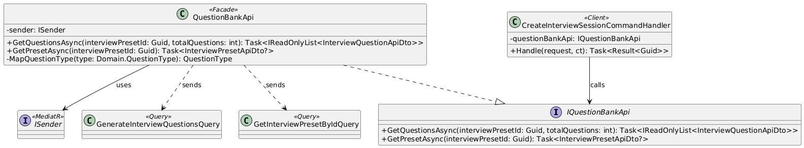

```csharp
public interface IQuestionBankApi
{
    Task<IReadOnlyList<InterviewQuestionApiDto>> GetQuestionsAsync(Guid interviewPresetId, int totalQuestions);
    Task<InterviewPresetApiDto?> GetPresetAsync(Guid interviewPresetId);
}

internal class QuestionBankApi(ISender sender) : IQuestionBankApi
{
    public async Task<IReadOnlyList<InterviewQuestionApiDto>> GetQuestionsAsync(Guid interviewPresetId, int totalQuestions)
    {
        var result = await sender.Send(new GenerateInterviewQuestionsQuery(interviewPresetId, totalQuestions));

        if (result.IsFailure)
            return [];

        return result.Value.Select(q => new InterviewQuestionApiDto
        {
            Text = q.Text,
            Type = MapQuestionType(q.Type),
            OrderIndex = q.OrderIndex,
            ProgrammingLanguageCode = q.ProgrammingLanguageCode,
            TimeLimitMs = q.TimeLimitMs,
            MemoryLimitMb = q.MemoryLimitMb,
            ReferenceSolution = q.ReferenceSolution,
            TestCases = q.TestCases.Select(tc => new TestCaseApiDto
            {
                Input = tc.Input,
                ExpectedOutput = tc.ExpectedOutput,
                IsHidden = tc.IsHidden
            }).ToList()
        }).ToList();
    }

    public async Task<InterviewPresetApiDto?> GetPresetAsync(Guid interviewPresetId)
    {
        var result = await sender.Send(new GetInterviewPresetByIdQuery(interviewPresetId));

        if (result.IsFailure)
            return null;

        return new InterviewPresetApiDto
        {
            Id = result.Value.Id,
            Name = result.Value.Name
        };
    }

    private QuestionType MapQuestionType(Domain.QuestionType type)
        => type switch
        {
            Domain.QuestionType.Coding => QuestionType.Coding,
            Domain.QuestionType.Theory => QuestionType.Theory,
            _ => throw new ArgumentOutOfRangeException(nameof(type), type, null)
        };
}

internal class CreateInterviewSessionCommandHandler(
    IDbContext dbContext,
    IQuestionBankApi questionBankApi) : IRequestHandler<CreateInterviewSessionCommand, Result<Guid>>
{
    public async Task<Result<Guid>> Handle(CreateInterviewSessionCommand request, CancellationToken ct)
    {
        var presetInfo = await questionBankApi.GetPresetAsync(request.InterviewPresetId);
        var questions = await questionBankApi.GetQuestionsAsync(request.InterviewPresetId, 5);

        // остальная логика
        return Result.Success(Guid.NewGuid());
    }
}
```

#### 2. Adapter

**Общее назначение:**  
Преобразует интерфейс или формат данных одного компонента в интерфейс, ожидаемый другим компонентом. Это позволяет взаимодействовать несовместимым частям системы без изменения их внутренней реализации.

**Назначение в рамках проекта:**  
В проекте `CodeSubmissionCompletedEventAdapter` адаптирует доменную сущность `CodeSubmission` к интеграционному событию `CodeSubmissionCompleted`. Благодаря этому `CodeSubmissionEventPublisher` публикует события через единый интерфейс адаптера и не содержит внутри себя логику маппинга Verdict, TestCaseResults, PassedCount и других полей события.

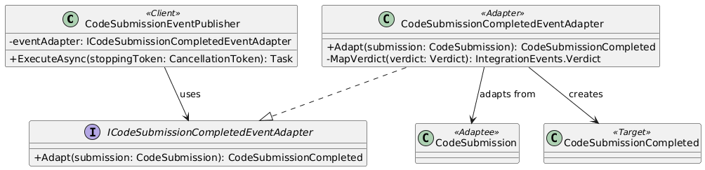

```csharp
internal interface ICodeSubmissionCompletedEventAdapter
{
    CodeSubmissionCompleted Adapt(CodeSubmission submission);
}

internal sealed class CodeSubmissionCompletedEventAdapter : ICodeSubmissionCompletedEventAdapter
{
    public CodeSubmissionCompleted Adapt(CodeSubmission submission)
    {
        var testCaseResults = new List<TestCaseResultDto>();
        var passedCount = 0;

        foreach (var testCase in submission.TestCases)
        {
            testCaseResults.Add(new TestCaseResultDto(
                TestCaseId: testCase.Id,
                Input: testCase.Input,
                ExpectedOutput: testCase.ExpectedOutput,
                ActualOutput: testCase.ActualOutput,
                Order: testCase.Order,
                Error: testCase.Error,
                ExitCode: testCase.ExitCode,
                TimeElapsed: testCase.TimeElapsed,
                MemoryUsage: testCase.MemoryUsage,
                Verdict: MapVerdict(testCase.Verdict)));

            if (testCase.Verdict == Verdict.OK)
                passedCount++;
            else
                break;
        }

        var overallVerdict = submission.Status == ExecutionStatus.Failed
            ? IntegrationEvents.Verdict.FailedSystem
            : MapVerdict(submission.OverallVerdict);

        return new CodeSubmissionCompleted(
            SubmissionId: submission.Id,
            TestCaseResults: testCaseResults.ToArray(),
            OverallVerdict: overallVerdict,
            PassedCount: passedCount,
            TotalTests: submission.TestCases.Count);
    }

    private static IntegrationEvents.Verdict MapVerdict(Verdict verdict) =>
        verdict switch
        {
            Verdict.OK => IntegrationEvents.Verdict.OK,
            Verdict.CE => IntegrationEvents.Verdict.CE,
            Verdict.RE => IntegrationEvents.Verdict.RE,
            Verdict.TLE => IntegrationEvents.Verdict.TLE,
            Verdict.MLE => IntegrationEvents.Verdict.MLE,
            Verdict.WA => IntegrationEvents.Verdict.WA,
            _ => IntegrationEvents.Verdict.FailedSystem
        };
}

internal class CodeSubmissionEventPublisher(
    IServiceProvider serviceProvider,
    IBus bus,
    ICodeSubmissionCompletedEventAdapter eventAdapter) : BackgroundService
{
    protected override async Task ExecuteAsync(CancellationToken stoppingToken)
    {
        while (!stoppingToken.IsCancellationRequested)
        {
            using var scope = serviceProvider.CreateScope();
            var dbContext = scope.ServiceProvider.GetRequiredService<IDbContext>();

            var submissions = await dbContext.CodeSubmissions
                .Where(s => !s.IsEventPublished
                            && (s.Status == ExecutionStatus.Completed || s.Status == ExecutionStatus.Failed))
                .Include(s => s.TestCases.OrderBy(tc => tc.Order))
                .OrderBy(s => s.CompletedAt)
                .ToListAsync(stoppingToken);

            if (submissions.Count == 0)
                await Task.Delay(500, stoppingToken);

            foreach (var submission in submissions)
            {
                var @event = eventAdapter.Adapt(submission);
                await bus.Publish(@event, stoppingToken);
                submission.IsEventPublished = true;
            }

            await dbContext.SaveChangesAsync(stoppingToken);
        }
    }
}
```

#### 3. Decorator

**Общее назначение:**  
Декоратор позволяет динамически добавлять объекту новую функциональность, оборачивая его в объект с тем же интерфейсом. Это даёт возможность расширять поведение без изменения исходного класса

**Назначение в рамках проекта:**  
В проекте `LoggingQuestionBankApiDecorator` расширяет функциональность `IQuestionBankApi`, добавляя логирование и замер времени выполнения методов `GetQuestionsAsync` и `GetPresetAsync`. Декоратор оборачивает реальную реализацию (`QuestionBankApi`)

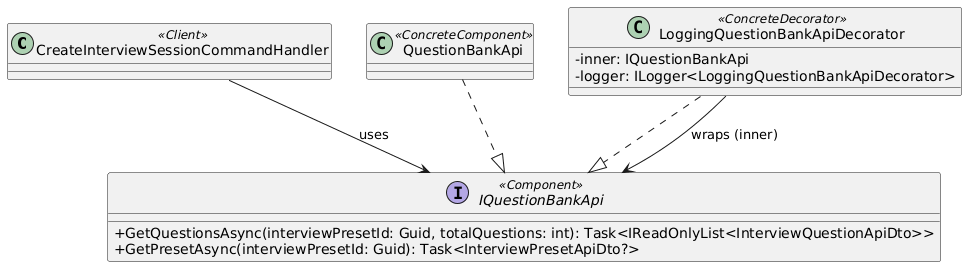

```csharp
internal sealed class LoggingQuestionBankApiDecorator(
    IQuestionBankApi inner,
    ILogger<LoggingQuestionBankApiDecorator> logger) : IQuestionBankApi
{
    public async Task<IReadOnlyList<InterviewQuestionApiDto>> GetQuestionsAsync(Guid interviewPresetId, int totalQuestions)
    {
        var sw = Stopwatch.StartNew();
        try
        {
            var result = await inner.GetQuestionsAsync(interviewPresetId, totalQuestions);

            logger.LogInformation(
                "QuestionBankApi.GetQuestionsAsync presetId={PresetId} requested={Requested} returned={Returned} elapsedMs={ElapsedMs}",
                interviewPresetId, totalQuestions, result.Count, sw.ElapsedMilliseconds);

            return result;
        }
        catch (Exception ex)
        {
            logger.LogError(
                ex,
                "QuestionBankApi.GetQuestionsAsync failed presetId={PresetId} requested={Requested} elapsedMs={ElapsedMs}",
                interviewPresetId, totalQuestions, sw.ElapsedMilliseconds);

            throw;
        }
    }

    public async Task<InterviewPresetApiDto?> GetPresetAsync(Guid interviewPresetId)
    {
        var sw = Stopwatch.StartNew();
        try
        {
            var result = await inner.GetPresetAsync(interviewPresetId);

            logger.LogInformation(
                "QuestionBankApi.GetPresetAsync presetId={PresetId} found={Found} elapsedMs={ElapsedMs}",
                interviewPresetId, result is not null, sw.ElapsedMilliseconds);

            return result;
        }
        catch (Exception ex)
        {
            logger.LogError(
                ex,
                "QuestionBankApi.GetPresetAsync failed presetId={PresetId} elapsedMs={ElapsedMs}",
                interviewPresetId, sw.ElapsedMilliseconds);

            throw;
        }
    }
}
```

#### 4. Proxy

**Общее назначение:**  
Прокси предоставляет объект-заместитель с тем же интерфейсом, что и реальный объект, чтобы контролировать доступ к нему и/или добавлять дополнительное поведение без изменения клиента и реального объекта

**Назначение в рамках проекта:**  
В проекте `CachedQuestionBankApiProxy` выступает прокси для `IQuestionBankApi`: он перехватывает вызов `GetPresetAsync`, проверяет наличие пресета в `IMemoryCache` и при наличии возвращает кэшированное значение, а при отсутствии — запрашивает данные у реальной реализации, сохраняет результат в кэш на `PresetTtl` и возвращает его. Благодаря этому клиент (`CreateInterviewSessionCommandHandler`) продолжает работать через `IQuestionBankApi`, но получает ускорение повторных запросов пресетов и снижение нагрузки на модуль QuestionBank.

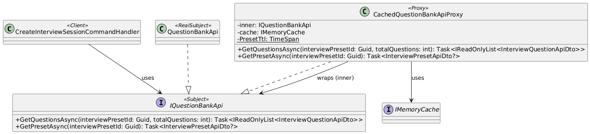

```csharp
internal sealed class CachedQuestionBankApiProxy(
    IQuestionBankApi inner,
    IMemoryCache cache) : IQuestionBankApi
{
    private static readonly TimeSpan PresetTtl = TimeSpan.FromMinutes(10);

    public Task<IReadOnlyList<InterviewQuestionApiDto>> GetQuestionsAsync(Guid interviewPresetId, int totalQuestions)
        => inner.GetQuestionsAsync(interviewPresetId, totalQuestions);

    public async Task<InterviewPresetApiDto?> GetPresetAsync(Guid interviewPresetId)
    {
        var key = $"qb:preset:{interviewPresetId}";

        if (cache.TryGetValue(key, out InterviewPresetApiDto? cached))
            return cached;

        var result = await inner.GetPresetAsync(interviewPresetId);
        if (result is not null)
            cache.Set(key, result, PresetTtl);

        return result;
    }
}
```

### Поведенческие шаблоны

#### 1. Command

**Общее назначение:**  
Позволяет инкапсулировать запрос на выполнение определенного действия в виде отдельного объекта. Позволяет централизованно подключать сквозные механизмы обработки (валидация, логирование, ретраи) независимо от конкретной бизнес-операции.

**Назначение в рамках проекта:**  
Команды (`CreateInterviewSessionCommand`, `CheckSubmissionCommand` и др.) инкапсулируют бизнес-операции в отдельные объекты запросов, а обработчики выполняют бизнес-логику. Контроллер формирует команду и отправляет. Также через `MediatR` к командам централизованно могут быть подключены сквозные механизмы (например, валидация, логирование, обработка ошибок), не изменяя код контроллеров и самих бизнес-операций.

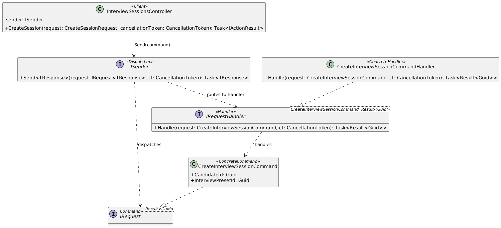

```csharp
[HttpPost]
public async Task<IActionResult> CreateSession([FromBody] CreateSessionRequest request, CancellationToken cancellationToken = default)
{
    var command = new CreateInterviewSessionCommand(request.CandidateId, request.InterviewPresetId);
    var result = await sender.Send(command, cancellationToken);

    return result.IsFailure
        ? result.ToProblem()
        : Created($"/api/v1/interview-sessions/{result.Value}", new { sessionId = result.Value });
}

public record CreateInterviewSessionCommand(Guid CandidateId, Guid InterviewPresetId) : IRequest<Result<Guid>>;

internal class CreateInterviewSessionCommandHandler(
    IDbContext dbContext,
    IQuestionBankApi questionBankApi) : IRequestHandler<CreateInterviewSessionCommand, Result<Guid>>
{
    public async Task<Result<Guid>> Handle(CreateInterviewSessionCommand request, CancellationToken ct)
    {
        // бизнес-логика создания сессии
        return Result.Success(sessionId);
    }
}
```

#### 2. Mediator

**Общее назначение:**  
Mediator централизует взаимодействие между компонентами: объекты не вызывают друг друга напрямую, а обмениваются запросами через посредника. Это снижает связность

**Назначение в рамках проекта:**  
В проекте роль медиатора выполняет `MediatR` (`ISender`). Контроллеры отправляют команды и запросы через `sender.Send(...)`, а соответствующие Handler-классы выполняют бизнес-логику. Контроллер не зависит от конкретных сервисов use-case и не знает, какой обработчик вызовется.

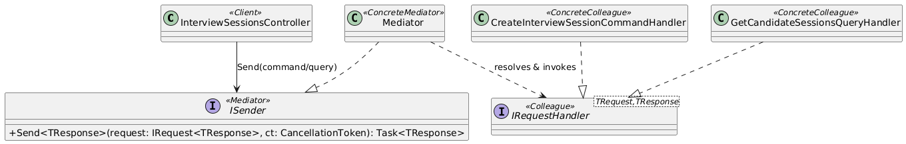

```csharp
public class InterviewSessionsController(ISender sender) : ControllerBase
{
    [HttpPost]
    public async Task<IActionResult> CreateSession([FromBody] CreateSessionRequest request, CancellationToken cancellationToken = default)
    {
        var command = new CreateInterviewSessionCommand(request.CandidateId, request.InterviewPresetId);
        var result = await sender.Send(command, cancellationToken);
        ...
    }

    [HttpGet("candidate/{candidateId:Guid}")]
    public async Task<IActionResult> GetCandidateSessions(Guid candidateId, CancellationToken cancellationToken = default)
    {
        var query = new GetCandidateSessionsQuery(candidateId);
        var result = await sender.Send(query, cancellationToken);
        ...
    }
}
```

#### 3. Observer

**Общее назначение:**  
Observer задаёт зависимость «один-ко-многим»: при изменении состояния издатель публикует событие, а все подписчики получают уведомление и реагируют независимо друг от друга.

**Назначение в рамках проекта:**  
В проекте `CodeSubmissionEventPublisher` публикует событие `CodeSubmissionCompleted` через `MassTransit` (`IBus`). Это позволяет модулю выполнения кода уведомлять другие компоненты (например, модуль интервью) без прямых зависимостей между ними. На одно событие могут подписываться несколько consumers, и каждый обрабатывает его в своей ответственности

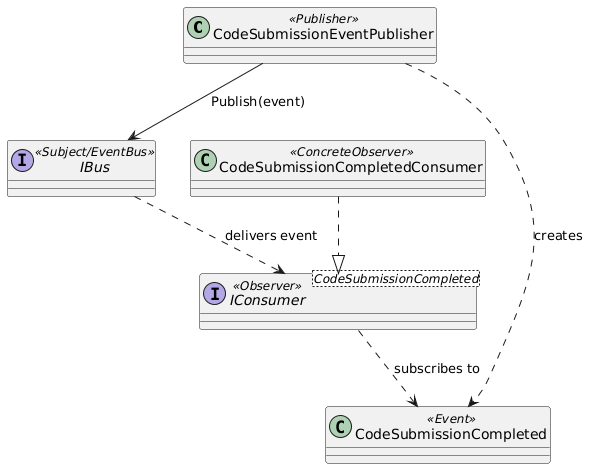

```csharp
internal class CodeSubmissionEventPublisher(IServiceProvider serviceProvider, IBus bus) : BackgroundService
{
    protected override async Task ExecuteAsync(CancellationToken stoppingToken)
    {
        // ...
        foreach (var submission in submissions)
        {
            var @event = ToIntegrationEvent(submission);
            await bus.Publish(@event, stoppingToken);
            submission.IsEventPublished = true;
        }
        // ...
    }
}

public class CodeSubmissionCompletedConsumer(
    ILogger<CodeSubmissionCompletedConsumer> logger) : IConsumer<CodeSubmissionCompleted>
{
    public Task Consume(ConsumeContext<CodeSubmissionCompleted> context)
    {
        // обработка события

        return Task.CompletedTask;
    }
}
```

#### 4. Strategy

**Общее назначение:**  
Определяет семейство алгоритмов, инкапсулирует каждый алгоритм в отдельный класс и делает их взаимозаменяемыми. Это позволяет изменять поведение объекта без изменения его кода

**Назначение в рамках проекта:**  
В проекте `CodeExecutor` использует стратегии формирования `ExecuteCodeRequest` в зависимости от типа языка (компилируемый или интерпретируемый).
`CompiledExecutionRequestStrategy` формирует команды компиляции и запуска бинарного файла, `InterpretedExecutionRequestStrategy` формирует команду прямого запуска скрипта. `CodeExecutor` выбирает стратегию через `CanHandle(...)` и выполняет общий алгоритм исполнения без if/else по типу языка.

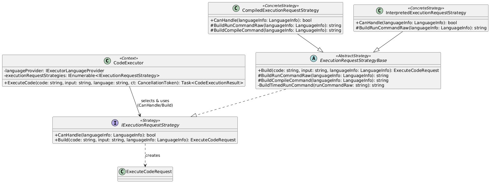

```csharp
internal interface IExecutionRequestStrategy
{
    bool CanHandle(LanguageInfo languageInfo);

    ExecuteCodeRequest Build(string code, string input, LanguageInfo languageInfo);
}

internal abstract class ExecutionRequestStrategyBase : IExecutionRequestStrategy
{
    public abstract bool CanHandle(LanguageInfo languageInfo);

    public ExecuteCodeRequest Build(string code, string input, LanguageInfo languageInfo)
    {
        var runCommandRaw = BuildRunCommandRaw(languageInfo);
        var runCommand = BuildTimedRunCommand(runCommandRaw);
        var compileCommand = BuildCompileCommand(languageInfo);

        return new ExecuteCodeRequest
        {
            Code = code,
            Input = input,
            IsCompiled = languageInfo.IsCompiled,
            DockerImage = languageInfo.DockerImage,
            RunCommand = runCommand,
            CompileCommand = compileCommand,
            DefaultFileName = languageInfo.DefaultFileName,
            DefaultTimeoutSeconds = languageInfo.DefaultTimeoutSeconds,
            MaxMemoryMb = languageInfo.MaxMemoryMb,
            MaxCpuCores = languageInfo.MaxCpuCores
        };
    }

    protected abstract string BuildRunCommandRaw(LanguageInfo languageInfo);

    protected virtual string BuildCompileCommand(LanguageInfo languageInfo) => string.Empty;

    private static string BuildTimedRunCommand(string runCommandRaw)
        => "/usr/bin/time -f 'TIME_ELAPSED:%e\nMEMORY_USAGE:%M' -o /code/time_output.txt " + runCommandRaw;
}

internal sealed class CompiledExecutionRequestStrategy : ExecutionRequestStrategyBase
{
    public override bool CanHandle(LanguageInfo languageInfo) => languageInfo.IsCompiled;

    protected override string BuildRunCommandRaw(LanguageInfo languageInfo) => "/code/program.out";

    protected override string BuildCompileCommand(LanguageInfo languageInfo)
        => languageInfo.CompileCommandTemplate
            .Replace("{input}", "/code/" + languageInfo.DefaultFileName)
            .Replace("{output}", "/code/program.out");
}

internal sealed class InterpretedExecutionRequestStrategy : ExecutionRequestStrategyBase
{
    public override bool CanHandle(LanguageInfo languageInfo) => !languageInfo.IsCompiled;

    protected override string BuildRunCommandRaw(LanguageInfo languageInfo)
        => languageInfo.RunCommandTemplate.Replace("{file_path}", "/code/" + languageInfo.DefaultFileName);
}

internal class CodeExecutor(
    IExecutorLanguageProvider languageProvider,
    IEnumerable<IExecutionRequestStrategy> executionRequestStrategies) : ICodeExecutor
{
    public async Task<CodeExecutionResult> ExecuteCode(
        string code,
        string input,
        string language,
        CancellationToken cancellationToken = default)
    {
        var langConfig = languageProvider.GetLanguage(language);
        var strategy = executionRequestStrategies.FirstOrDefault(x => x.CanHandle(langConfig));
        if (strategy is null)
            throw new InvalidOperationException($"Execution strategy not found for language: {langConfig.Code}");

        var request = strategy.Build(code, input, langConfig);
        return await ExecuteCodeInternal(request, cancellationToken);
    }
}
```

#### 5. Template Method

**Общее назначение:**  
Определяет общий алгоритм поведения подклассов, позволяя им переопределить отдельные шаги этого алгоритма без изменения его структуры

**Назначение в рамках проекта:**  
В проекте базовый класс `ExecutionRequestStrategyBase` задаёт общий алгоритм сборки ExecuteCodeRequest в методе `Build(...)`: формирование run-команды с таймингом, сборка общих полей запроса, подключение compile-команды.
Конкретные классы `CompiledExecutionRequestStrategy` и `InterpretedExecutionRequestStrategy` переопределяют только различающиеся шаги (`BuildRunCommandRaw`, `BuildCompileCommand`), не дублируя общий процесс.

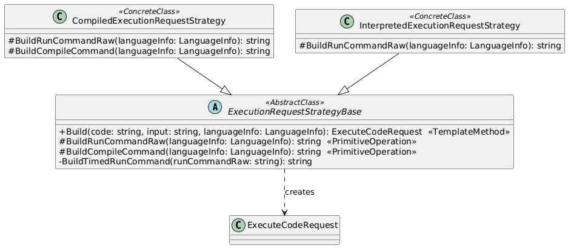

```csharp
internal abstract class ExecutionRequestStrategyBase : IExecutionRequestStrategy
{
    public abstract bool CanHandle(LanguageInfo languageInfo);

    public ExecuteCodeRequest Build(string code, string input, LanguageInfo languageInfo)
    {
        var runCommandRaw = BuildRunCommandRaw(languageInfo);
        var runCommand = BuildTimedRunCommand(runCommandRaw);
        var compileCommand = BuildCompileCommand(languageInfo);

        return new ExecuteCodeRequest
        {
            Code = code,
            Input = input,
            IsCompiled = languageInfo.IsCompiled,
            DockerImage = languageInfo.DockerImage,
            RunCommand = runCommand,
            CompileCommand = compileCommand,
            DefaultFileName = languageInfo.DefaultFileName,
            DefaultTimeoutSeconds = languageInfo.DefaultTimeoutSeconds,
            MaxMemoryMb = languageInfo.MaxMemoryMb,
            MaxCpuCores = languageInfo.MaxCpuCores
        };
    }

    protected abstract string BuildRunCommandRaw(LanguageInfo languageInfo);

    protected virtual string BuildCompileCommand(LanguageInfo languageInfo) => string.Empty;

    private static string BuildTimedRunCommand(string runCommandRaw)
        => "/usr/bin/time -f 'TIME_ELAPSED:%e\nMEMORY_USAGE:%M' -o /code/time_output.txt " + runCommandRaw;
}

internal sealed class CompiledExecutionRequestStrategy : ExecutionRequestStrategyBase
{
    public override bool CanHandle(LanguageInfo languageInfo) => languageInfo.IsCompiled;

    protected override string BuildRunCommandRaw(LanguageInfo languageInfo) => "/code/program.out";

    protected override string BuildCompileCommand(LanguageInfo languageInfo)
        => languageInfo.CompileCommandTemplate
            .Replace("{input}", "/code/" + languageInfo.DefaultFileName)
            .Replace("{output}", "/code/program.out");
}

internal sealed class InterpretedExecutionRequestStrategy : ExecutionRequestStrategyBase
{
    public override bool CanHandle(LanguageInfo languageInfo) => !languageInfo.IsCompiled;

    protected override string BuildRunCommandRaw(LanguageInfo languageInfo)
        => languageInfo.RunCommandTemplate.Replace("{file_path}", "/code/" + languageInfo.DefaultFileName);
}
```

## Шаблоны проектирования GRASP
